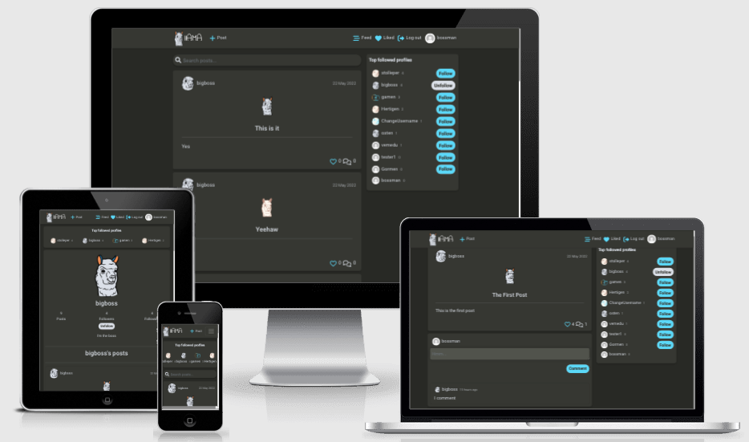
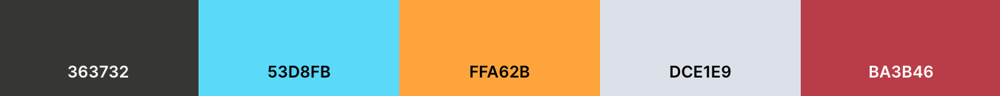
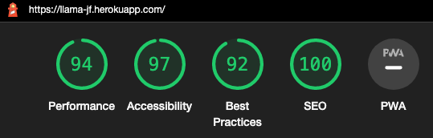

<h1 align="center" style="font-size: 250%;"><b>
llAMA
</b></h1>

llAMA is a niche AMA-type platform for people to connect, ask and answer anything in a playful manner.

The purpose of the site is to provide a place where people can read, post, comment, follow, like and create a profile to interact with other users and provide a place where any questions or discussions can be had while also having fun.

Target audience is mainly younger people and others who are well-versed in internet culture, who will most likely also appreciate the entertainment value of the applications brand.

It is designed to look and feel similar applications like Twitter and Instagram. It has a simple layout to encourage a lighter spin on anything being posted or discussed on the app.

Users can register an account to access full CRUD functionality for different interactions across the site.

As an early build, llAMA is currently a barebones/MVP application.

The frontend application is connected to the llAMA API, a custom-built backend application designed specifically for the llAMA app. The repo can be found [here](https://github.com/JFrdrkssn/llama-be).

[Check the live project here!](https://llama-jf.herokuapp.com/)

  

# **Design**

 

  

- ## **Brand**

  - The brand logo is a llama, which is also the name of the application. It has long been a popular animal in internet culture, most often used in memes, GIFs and other content meant primarily for entertainment purposes.
  - The brand and logo fits nicely with the project goal of creating a social media app that doesn't take it itself too seriously.

    

- ## **Color Scheme**

  - A dark grey background coupled with a light shade of grey for text provides the basis for application with clear contrast that is easy on the eyes. Shades of blue and orange declare interactive elements, such as links and buttons, contrasted with white elements for interactions such as unliking and unfollowing.
  - The navigation bar and content cards on the application has a sligthly brighter dark grey background, providing some contrast between the main background and other content.
  - CTA elements are light blue.
  - Like icons on user's owned posts are red to visually differentiate and declare it as non-interactive.
    
      

- ## **Typography**

  - The Indie Flower font is used for the site logo. The font has a playful look and fits well with brand logo, a llama.
  - The Roboto font is used everywhere else on the site. It is clear, sleek and provide a good separation between characters, making it easy to read and blending in well. It is also one of the most popular fonts used in web applications today.
  - Sans-serif is used as a backup-font.

    

## **Wireframes**

 
Wireframes for the application are essentially the same as the finished site.

 

- [Home](src/assets/screenshots/home.png)
- [Logged in](src/assets/screenshots/home-logged-in.png)
- [Profile](src/assets/screenshots/profile.png)
- [Create/edit](src/assets/screenshots/create-edit.png)

  

# **Frontend**

 

## Developer Role

 

A frontend developer is mainly responsible for developing the user-facing side of web applications. Making sure the user is engaged and stays on the site is a primary objective. Responsiveness, accessibility, performance, interactivity and design all play a big factor in determining the success of an application, areas where the frontend developer plays a key role. As part of development teams, frontend developers primarily work with the UX/UI and backend teams, but UX/UI can also be part of a frontend developer's responsibilities.

  

## React

React is declarative JavaScript library. React allows building of independent, reusable UI components that can manage their own state to the DOM, pass values between other components as "props" and lifecycle methods to free up resources.

Several components in this project are reused across the app. Two examples are explained here:

The `<Avatar />` component is used to render profile images. Its props allow for setting source image and size, so the component can be used to set the size of profile images depending on where in the UI they are rendered. It renders specific profile images of users depending on where in the UI they are. For example, in the `<NavBar />` component a logged in user will see their profile image. On posts, the profile that created the post will have their profile image displayed.

The `<MoreDropdown />` component is used to render dropdown menus in the UI. It has to different menus to choose from. One is used for editing profiles and contain links to edit bio and profile image, edit username and update password. The other is used for editing or deleting posts and comments.

  

## React-Bootstrap

 

React-Bootstrap is used for styling and responsiveness. Compared to regular Bootstrap, it comes as ready-to-use components for React. It is very popular and is one of the oldest libraries for React. This ensures compability and a vast selection of components and styles to build upon. React-Bootstrap is also built with accessibility in mind, an important factor when creating a frontend application. I have used regular Bootstrap before so it was an easy choice.

  

# **Agile**

 

## **Project Goals**

 

The general goal of this project is to create a platform similar to Quora, Twitter and other social media apps, but with a lighter and simpler feel. Users can interact with other users in a number of ways, for example following a user or commenting on a post. As is evident in the design, the application doesn't take itself too serious. This is preferably instilled in users of the application as well. The idea is that the whole concept provides a basis for having fun while also learning new things without the pressure of formality. No questions are llame, basically.

The user stories in Sprint 1 fulfill the needs to build a working MVP application with a specific UI design, the primary goal set for this project.

- User authentication
- User interactivity
  - Posts, comments, likes, followers
- Profiles
  - Bios, profile images
- Engaging UX/UI

 

## **User Stories**

 

- ### **Sprint 1**

   

  - #### **Navigating the site**

    - As a user, I can view a navbar from every page so that I can easily navigate between pages.
    - As a user, I can clearly see if I'm logged in/out so that I can log/sign in/out.
    - As a user, I can see user avatars so that I can easily identify users of the application.
    - As a user, I can see a list of the most followed profiles so that I can find the most popular profiles.
        

  - #### **User authentication**

    - As a user, I can create a new account so that I can access all the features for signed up users.
    - As a user, I can log in to the app so that I can access functionality for logged in users.
    - As a user, I can maintain my logged-in status until I choose to log out so that my user experience is not compromised.
        

  - #### **Posting and liking posts**

    - As a logged in user, I can create posts so that I can share my experiences.
    - As a logged in user, I can like a post so that I can declare my support for posts I like.
        

  - #### **Post list page**

    - As a user, I can keep scrolling indefinitely so that I don't have to manually switch pages to view more content.
    - As a user, I can search with keywords so that I can find the posts I am looking for.
    - As a user, I can view the most recent posts first in descending order so that I am up to speed with the newest content.
    - As a logged in user, I can view the posts I've liked so that I can find the posts I've found interesting.
    - As a logged in user, I can filter content by profiles I follow so that I can easily view their content.
        

  - #### **Post detail page**

    - As a user, I can view the detailed page of a post so that I can interact with the post in more detail.
    - As a post creator, I can edit my post so that I can correct mistakes or add new content.
    - As a post creator, I can delete my post so that I can control the content I want removed.
    - As a user, I can read comments on a post so that I can see what people are saying about the content.
    - As a logged in user, I can comment on a post so that I can engage in conversation about the content.
    - As a comment owner, I can edit my comment so that I can correct or add to my existing comment.
    - As a comment owner, I can delete my comment so that I have control of my comments visibility.
    - As a user, I can see when a comment was added so that I know how old a comment is.
        

  - #### **Profile page**

    - As a user, I can view other profiles so that I can see their content and learn more about them.
    - As a logged in user, I can edit my profile so that I can update my profile picture and bio.
    - As a logged in user, I can update my username and password so that I can change my display name and password.
    - As a logged in user, I can follow or unfollow a profile so that I can decide what profile's content shows in my feed.
    - As a user, I can view statistics about a specific profile, such as number of posts and followers so that I can see the details of a particular profile.
    - As a user, I can view all the posts of a specific profile so that I can see their latest content.
        

- ### **Sprint 2**

   

  - #### **Categorising posts**

    - As a user, I can see a list of categories so that I can easily find specific subjects.
    - As a logged in user, I can add a category to my posts so that I can help other users understand what the subject is.
        

  - #### **Social account authentication**

    - As a user, I can authenticate using already created social accounts so that I don't have keep track of multiple accounts.
        

  - #### **Nested comments**
    - As a user, I can see threads of comments so that I can better follow conversations.
    - As a logged in user, I can reply to specific comments so that I can easily follow along conversations.
        

  

For this project the GitHub Kanban agile project management tool was used for workflow.
 

[Kanban](src/assets/screenshots/kanban.png)

  

# **Future Features**

 

## _These features are planned:_

 

- Categories
  - Categories to list posts of certain categories and allow users to select category when creating a post.
      
- Profile page additions
  - Additional fields where users can add more info about themselves.
      
- Nested comment system
  - A system for replying to certain comments and create threads.
      
- Most commented posts
  - With nested comments, displaying a list of most commented posts would allow easy access to the posts with the most active conversations.
      
- Social account authentication
  - Allow user authentication with already created accounts, for example Google accounts.
      

  

# **API**

 

The backend API is built specifically for this frontend with Django REST Framework. The repository and info on how the two are connected can be found in the Deployment section of [this](https://github.com/JFrdrkssn/llama-be) repo's README.

  

# **Technologies**

 

## **Languages**

- [HTML](https://en.wikipedia.org/wiki/HTML5)
- [CSS](https://en.wikipedia.org/wiki/CSS)
- [JavaScript](https://www.w3schools.com/js/js_es6.asp)
  - [JSX](https://reactjs.org/)

 

## **Programs, libraries, frameworks and dependencies**

- [Gitpod](https://gitpod.io)
  - Gitpod to host a virtual workspace.
- [Git](https://git-scm.com/)
  - Git for version control by utilizing the Gitpod terminal to commit and push to GitHub and Heroku.
- [GitHub](https://github.com/)
  - GitHub to store the project code after being pushed from Git.
- [React 17](https://17.reactjs.org/)
  - React Router for dynamic routing.
- [Axios](https://axios-http.com/docs/intro)
  - Axios for promise-based HTTP.
- [React Router](https://v5.reactrouter.com/web/guides/quick-start)
  - React Router for dynamic routing.
- [JWT](https://jwt.io/)
  - JWT for tokens and timestamping tokens.
- [React-Bootstrap 1.6](https://react-bootstrap-v4.netlify.app/)
  - React-Bootstrap for styling and responsiveness.
- [Heroku](https://id.heroku.com/login)
  - Heroku to host both the frontend and backends applications and connect them.
- [Google Fonts](https://fonts.google.com/)
  - Google fonts for importing the Indie Flower and Roboto fonts.
- [Font Awesome](https://fontawesome.com/)
  - Font Awesome for icons.
- [Balsamiq](https://balsamiq.com/)
  - Balsamiq to create wireframes for design purposes.
- [favicon.io](https://favicon.io/)
  - favicon to generate favicons.
- [Canva](https://www.canva.com/)
  - Canva to create logo and assets.
- [Coolors](https://coolors.co/?home)
  - Coolors was used to create the color scheme palette.
- [MSW](https://mswjs.io/)
  - MSW for testing purposes.
      

# **Testing**

 

The W3C Markup Validator, W3C CSS Validator Services, ESLint and PEP8 were used to validate code.

- [W3C Markup Validator](https://validator.w3.org/) show no errors.
  - [HTML](src/assets/screenshots/html-val.png)
- [W3C CSS Validator](https://jigsaw.w3.org/css-validator/) show no errors.
  - [CSS](src/assets/screenshots/css-val.png)
- [ESLint](https://eslint.org/) show no significant issues\*.
    

Lighthouse

  

## **Testing User Stories from Agile section**

 

- ### **Navigating the site**

  - As a user, I can view a navbar from every page so that I can easily navigate between pages.
    - Navbar is always visible and links display active states if user is on navbar link URLs.
  - As a user, I can clearly see if I'm logged in/out so that I can log/sign in/out.
    - If a user is not logged in, Log in and Sign up links are displayed. If a user is logged in, display links to profile page, log out, feed of followed user posts and liked posts feed.
  - As a user, I can see user avatars so that I can easily identify users of the application.
    - User profile images and names are displayed across the application on most content. They also link to the user's profile page.
  - As a user, I can see a list of the most followed profiles so that I can find the most popular profiles.
    - A list of the most followed profiles with follower count, listed in a descending order on desktop and from left to right on mobile, is always displayed. On desktop there's a button to follow/unfollow. On both desktop and mobile the users in the list view are links to that specific profile, where you can also choose to follow/unfollow.
        

- ### **User authentication**

  - As a user, I can create a new account so that I can access all the features for signed up users.
    - In the navbar there's a link to the Sign up page where users can create an account.
  - As a user, I can log in to the app so that I can access functionality for logged in users.
    - In the navbar there's a link to the Log in page where users can log in with their account.
  - As a user, I can maintain my logged-in status until I choose to log out so that my user experience is not compromised.
    - Users stay logged in for 24 hours unless choosing to log out themselves.
        

- #### **Posting and liking posts**

  - As a logged in user, I can create posts so that I can share my experiences.
    - In the navbar there's a link to the Post create page where users can create a post.
  - As a logged in user, I can like a post so that I can declare my support for posts I like.
    - A clickable like icon is displayed on all posts on both desktop and mobile for users to like or unlike posts.
        

- #### **Post list page**

  - As a user, I can keep scrolling indefinitely so that I don't have to manually switch pages to view more content.
    - If there's more than 10 posts and/or comments, scrolling to the bottom of the page automatically renders more content, allowing for infinite scroll.
  - As a user, I can search with keywords so that I can find the posts I am looking for.
    - Using the search bar, users can search for posts using keywords which renders posts containing the inputed text in the search bar.
  - As a user, I can view the most recent posts first in descending order so that I am up to speed with the newest content.
    - Posts are ordered based on creation date in a descending order.
  - As a logged in user, I can view the posts I've liked so that I can find the posts I've found interesting.
    - Clicking the "Liked" link in the navbar displays a list of posts the user has liked.
  - As a logged in user, I can filter content by profiles I follow so that I can easily view their content.
    - Clicking the "Feed" link in the navbar displays a list of posts from followed users.
        

- ### **Post detail page**

  - As a user, I can view the detailed page of a post so that I can interact with the post in more detail.
    - Clicking a post takes users to the specific post where users can comment on the post.
  - As a post creator, I can edit my post so that I can correct mistakes or add new content.
    - Clicking on a post the user owns, a dropdown menu is found at the top of the post where the user can go to the edit page. There the user can edit what they want and save the post or cancel.
  - As a post creator, I can delete my post so that I can control the content I want removed.
    - Clicking on a post the user owns, a dropdown menu is found at the top of the post where the user can choose to delete the post.
  - As a user, I can read comments on a post so that I can see what people are saying about the content.
    - Comments are displayed when clicking on a specific post.
  - As a logged in user, I can comment on a post so that I can engage in conversation about the content.
    - Click on a post takes the user to this specific post's page, where the user can comment.
  - As a comment owner, I can edit my comment so that I can correct or add to my existing comment.
    - A dropdown menu is displayed on comments owned by the user where users can choose to edit the comment.
  - As a comment owner, I can delete my comment so that I have control of my comments visibility.
    - A dropdown menu is displayed on comments owned by the user where user can choose to delete the comment.
  - As a user, I can see when a comment was added so that I know how old a comment is.
    - The creation date of a comment is shown on all comments. Comments that are edited get their creation date updated. Right now, there's no way to know if a comment has been edited by looking at the time it was added.
        

- ### **Profile page**

  - As a user, I can view other profiles so that I can see their content and learn more about them.
    - Clicking on a profile image or name takes the user to that specific profile page where a bio and stats are displayed.
  - As a logged in user, I can edit my profile so that I can update my profile picture and bio.
    - Going to user's own profile pages, there's a dropdown menu at the top where users can choose to go to the edit profile page where they can update their profile picture and bio.
  - As a logged in user, I can update my username and password so that I can change my display name and password.
    - Going to user's own profile pages, there's a dropdown menu at the top where users can choose to go to the edit username or password page where they can update their username, unless the username is already taken, or password.
  - As a logged in user, I can follow or unfollow a profile so that I can decide what profile's content shows in my feed.
    - On desktop, a list of the most followed profiles are shown with buttons to follow/unfollow. Users can also click the "Feed" link in the navbar to display a list followed user's posts, where they can go to the specific profile and choose to unfollow.
  - As a user, I can view statistics about a specific profile, such as number of posts and followers so that I can see the details of a particular profile.
    - On profile pages there's a separate counter each for Posts, Followed and Following.
  - As a user, I can view all the posts of a specific profile so that I can see their latest content.
    - On profile pages, that specific profile's posts are listed below the profile header.
        

  
